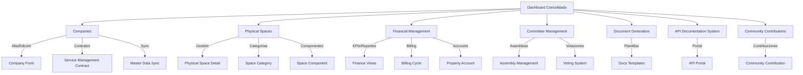

# Plan de Auditoría UX del Sistema (Master)

<!-- Documento maestro híbrido: Nielsen + Journey, alineado con RG-011 -->

**Proyecto:** Condominium Management
**Marco:** RELAY 48H (Día 1 – ChatGPT Lead)
**Fecha inicio:** 2025-10-18
**Responsable ejecución:** Claude Code

---

## A. Introducción y Alcance

### Propósito

Realizar auditoría completa de usabilidad y experiencia de usuario (UX) del sistema de gestión de condominios, identificando puntos de fricción, gaps funcionales y oportunidades de mejora en los flujos principales de usuario.

### Alcance del Ciclo RELAY 48H

**Día 1 (ChatGPT Lead):**
- Estructura completa del plan de auditoría
- Evaluación inicial del módulo Companies (entry point crítico)
- Al menos 1-2 heurísticas Nielsen con observaciones reales
- Un user journey completo documentado
- Identificación preliminar de friction points

**Día 2 (Claude Observer):**
- Completar evaluación heurística de Companies
- Capturar evidencias (screenshots/videos)
- Iniciar evaluación de Physical Spaces
- Consolidar hallazgos globales

### Criterios de Éxito

- [ ] Estructura completa de auditoría creada según RG-011
- [ ] Módulo Companies evaluado con metodología híbrida
- [ ] Al menos 3 friction points identificados con evidencias
- [ ] Propuestas de mejora priorizadas
- [ ] Documentación lista para implementar mejoras en siguientes sprints

---

## B. Mapa de Navegación del Sistema

<!-- Mapa basado en módulos reales implementados en condominium_management/ -->

---

## C. Matriz de Roles / Personas

| Rol | Objetivo Principal | Frecuencia de Uso | Módulos Principales | Fricciones Detectadas (Preliminar) |
|-----|-------------------|-------------------|---------------------|-------------------------------------|
| **Administrador de Condominio** | Gestión operativa diaria del condominio | Diaria | Companies, Physical Spaces, Financial Management | TBD - Evaluar en journey |
| **Contador/Auditor** | Revisión financiera y reportes | Semanal/Mensual | Financial Management, Dashboard Consolidado | TBD - Evaluar en journey |
| **Presidente del Comité** | Gobernanza y toma de decisiones | Semanal | Committee Management, Dashboard Consolidado | TBD - Evaluar en journey |
| **Residente** | Consulta de información personal | Ocasional | (Módulo pendiente implementación) | N/A |
| **Super Admin (IT)** | Configuración y mantenimiento del sistema | Ocasional | Todos los módulos, especialmente Companies | TBD - Evaluar en journey |

---

## D. Metodología Híbrida

### D.1 Heurística Nielsen (10 Principios)

Evaluación sistemática basada en las 10 heurísticas de usabilidad de Jakob Nielsen:

1. **Visibilidad del estado del sistema**
   - ¿El usuario sabe dónde está y qué está pasando?

2. **Correspondencia sistema-mundo real**
   - ¿El sistema usa lenguaje familiar al usuario?

3. **Control y libertad del usuario**
   - ¿Puede el usuario deshacer acciones fácilmente?

4. **Consistencia y estándares**
   - ¿Elementos similares funcionan de manera similar?

5. **Prevención de errores**
   - ¿El sistema previene errores antes de que ocurran?

6. **Reconocimiento antes que recuerdo**
   - ¿Las opciones son visibles vs. requieren memorización?

7. **Flexibilidad y eficiencia de uso**
   - ¿Hay atajos para usuarios avanzados?

8. **Diseño estético y minimalista**
   - ¿Información relevante vs. ruido visual?

9. **Ayuda a reconocer, diagnosticar y recuperarse de errores**
   - ¿Mensajes de error claros y accionables?

10. **Ayuda y documentación**
    - ¿Documentación accesible y útil?

**Escala de severidad:**
- **Alta:** Bloquea la tarea del usuario
- **Media:** Dificulta significativamente la tarea
- **Baja:** Molestia menor, no impide completar tarea

### D.2 Journey Recreation (Recreación de Flujo de Usuario)

**Metodología:**

1. **Definir contexto:**
   - Rol del usuario
   - Objetivo de la tarea
   - Precondiciones (permisos, datos existentes)

2. **Ejecutar flujo en entorno real:**
   - Usar admin1.dev u otro site de testing
   - Documentar cada paso
   - Capturar screenshots/videos

3. **Identificar fricciones:**
   - Pasos confusos
   - Información faltante
   - Errores inesperados
   - Tareas que requieren workarounds

4. **Documentar resultados:**
   - Resultado esperado vs. resultado real
   - Tiempo requerido vs. tiempo esperado
   - Nivel de frustración

**Criterios de "fricción":**
- Usuario debe buscar información fuera del sistema
- Requiere más de 3 clics para tarea simple
- Mensajes de error no accionables
- Campos obligatorios no marcados claramente
- Validaciones que fallan sin explicación clara

---

## E. Plan de Evaluación Modular

### Orden de Evaluación (Priorizado)

**Fase 1 (Fundación) - Semanas 1-2:**

1. **Companies** ← **INICIO (Día 1)**
   - **Razón:** Entry point del sistema, toda operación depende de Company
   - **Evaluación:** `modulos/companies-module/`
   - **Prioridad:** CRÍTICA

2. **Physical Spaces**
   - **Razón:** Define estructura física del condominio
   - **Evaluación:** `modulos/physical-spaces-module/`
   - **Prioridad:** ALTA

3. **Financial Management**
   - **Razón:** Core del negocio (facturación, pagos)
   - **Evaluación:** `modulos/financial-management-module/`
   - **Prioridad:** ALTA

**Fase 2 (Operación Avanzada) - Semanas 3-4:**

4. Committee Management
5. Dashboard Consolidado
6. Document Generation

**Fase 3 (Soporte) - Semanas 5-6:**

7. API Documentation System
8. Community Contributions

### Proceso por Módulo

Para cada módulo:

1. **Ejecutar `evaluation.md`** (Nielsen)
   - Evaluar cada una de las 10 heurísticas
   - Asignar severidad (A/M/B)
   - Referenciar evidencias

2. **Ejecutar `user-journey.md`** (Recreación)
   - Definir 2-3 journeys principales del módulo
   - Ejecutar en entorno real
   - Capturar evidencias en `evidencias/`
   - Documentar fricciones

3. **Documentar resultados:**
   - `resultados/friction-points.md` - Problemas identificados
   - `resultados/improvement-proposals.md` - Propuestas de solución

4. **Priorizar mejoras:**
   - Impacto vs. esfuerzo
   - Alineación con objetivos de negocio

---

## F. Consolidado de Resultados

### Hallazgos Globales

**Ubicación:** `resultados/hallazgos-globales.md`

**Contenido:**
- Resumen por módulo
- Tendencias transversales (problemas que se repiten)
- Top 5 problemas sistémicos
- Comparativa entre módulos

### Recomendaciones Priorizadas

**Ubicación:** `resultados/recomendaciones-priorizadas.md`

**Contenido:**
- Matriz de priorización (Impacto × Esfuerzo)
- Quick wins (bajo esfuerzo, alto impacto)
- Mejoras estratégicas (alto esfuerzo, alto impacto)
- Roadmap sugerido de implementación

---

## G. Verificación Técnica

### Checklist de Verificación

**Ubicación:** `config/verification-checklist.md`

**Ejecución:** Al finalizar cada día del ciclo RELAY

**Contenido:**
- Verificación de estructura de archivos
- Validación de sintaxis (mermaid, markdown)
- Comprobación de nombres de módulos
- Verificación de contenido mínimo
- Anti-HTML (solo markdown puro)
- Presencia de evidencias reales

**Resultado:** Reporte ✅/⚠️ con fixes sugeridos si aplica

---

## H. Próximos Pasos (Post Día 1)

### Para Día 2 (Claude Observer):

1. **Completar Companies:**
   - Heurísticas 3-10 con observaciones reales
   - Capturar evidencias (screenshots mínimo 5, videos 1-2)
   - Completar friction-points.md con tabla completa
   - Proponer 3-5 mejoras priorizadas

2. **Iniciar Physical Spaces:**
   - Estructura completa de evaluación
   - Al menos 2 heurísticas con observaciones
   - 1 user journey documentado

3. **Consolidado preliminar:**
   - Identificar 2-3 tendencias transversales
   - Quick wins identificados

### Para Semana 2:

- Completar Financial Management
- Consolidado de hallazgos globales
- Roadmap de mejoras priorizado

---

**Preparado por:** Claude Code
**Fecha:** 2025-10-18
**Versión:** 1.0
**Estado:** En ejecución - Día 1
